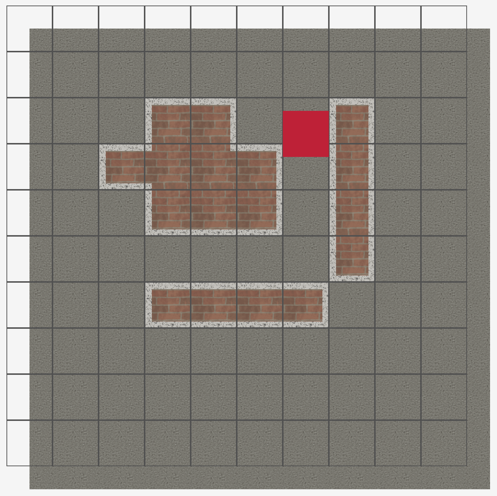
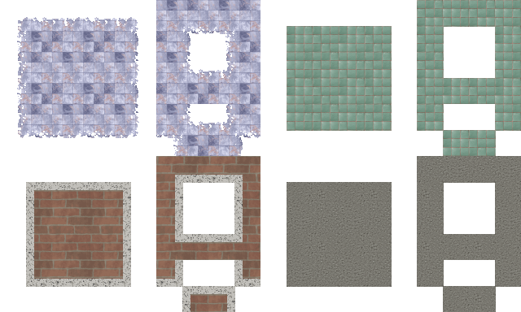

# Tilemap Collision and Renderer

Example of pixel perfect tilemap collision with code to render a wang tile tilemap for smooth borders.

## Tilemap Collision
`collision.odin` contains various functions for different types of collision detection. `pixel_perfect_collision_steps` is the most accurate one and works for fast moving objects 

Example usage it just requires movement direction and position. Will also need a global variable for the level.
```odin
player_move :: proc() {
    deltaTime := rl.GetFrameTime()

    moveDirection := [2]f32{}

    //Move player in certain direction
    if rl.IsKeyDown(.RIGHT) {
        moveDirection.x += 1
    }
    if rl.IsKeyDown(.LEFT) {
        moveDirection.x -= 1
    }
    if rl.IsKeyDown(.DOWN) {
        moveDirection.y += 1
    }
    if rl.IsKeyDown(.UP) {
       moveDirection.y -= 1
    }

    new_x := player.position.x + moveDirection.x * player.speed * deltaTime
    new_y := player.position.y + moveDirection.y * player.speed * deltaTime

    pixel_perfect_collision_steps(new_x, new_y, moveDirection)
    //pixel_perfect_collision(new_x, new_y, moveDirection)
    //next_to_wall(new_x, new_y, moveDirection)
    //naive_collision(new_x, new_y, moveDirection)
}

```

## Wang tile rendering


In `tilemap.odin` contains code for rendering wang tiles smoothly. It uses a layer approach so the use of transparent border tiles can be used therefore not requiring an artist to draw every combination of neighbouring tiles.

an enum is used to detemine tile locations. location is based on the top left corner piece as its starting point.

```odin
TILE_BITMASK := map[TILE_ENUMS][2]int {
    .Floor={5,3},
    .Wall={0,3}
}

load_texture :: proc() {
    WORLD_TEXTURE = {rl.LoadTexture("tilemap.png")}
}

unload_texture :: proc() {
    rl.UnloadTexture(WORLD_TEXTURE.rock)
}

Combinations :: struct {
    topLeft: [2]int,
    top: [2]int,
    topRight: [2]int,
    centerLeft: [2]int,
    center: [2]int,
    centerRight: [2]int,
    bottomleft: [2]int,
    bottom: [2]int,
    bottomRight: [2]int,
    bottomLeftRight: [2]int,
    bottomRightLeft: [2]int,
    topRightLeft: [2]int,
    topLeftRight: [2]int,
    crossLeftRight: [2]int,
    crossRightLeft: [2]int
}
```
